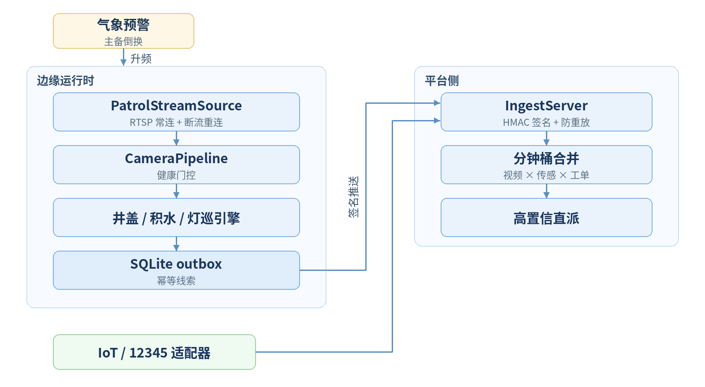
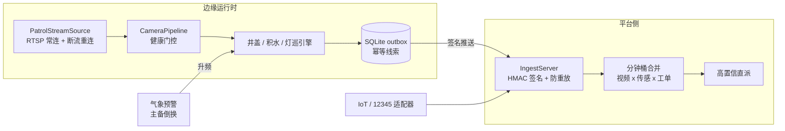

<div align="center">


**复用存量摄像头的城市生命线视频分析系统：井盖缺失、路面积水、路灯故障的自动发现与派单。**


<!-- 发布时将 OWNER/REPO 替换为实际仓库路径, 并将 ci.yml 复制到 .github/workflows/ci.yml -->


**[English](README_github.md)** | 简体中文


*图：积水通道四拍（掩膜与线索为真实分割器输出；干/湿两帧为示意配对，页脚有声明）——登记干态基线 → 暴雨袭来 → 物理水面分割 → risk3 线索上送。*

</div>

---

## 1. 背景与挑战

城市拥有成千上万路监控摄像头，但井盖丢失、路面积水、路灯故障这类民生
事件，仍主要依赖人工巡查与市民投诉发现。四项结构性不足：

| 挑战 | 现状描述 |
|------|---------|
| 覆盖盲区 | 固定摄像头视角有限，人工巡查无法覆盖全部点位与时段 |
| 响应滞后 | 事件从发生到投诉转办常以天计，存在安全隐患与舆情风险 |
| 误报率高 | 雨天、反光、阴影等场景下，传统分析几乎不可用 |
| 单源不可信 | 仅凭视频单一来源定级，误派与漏派难以两全 |

## 2. 核心能力

| # | 能力 | 说明 |
|---|------|------|
| 01 | 存量摄像头复用 | 不加装传感器，轮巡式分析替代逐帧解码；复用既有 GA-T1400 视频接入 |
| 02 | 三场景统一运行时 | 井盖变化（登记式基线）、路面积水（物理分割 + 干态基线门控）、路灯故障（台账 + 亮度基线）共享同一轮巡/推送/复核链路 |
| 03 | 双源融合定级 | 视频线索与 IoT 传感、市民上报在分钟桶融合总线配对，双源命中即高置信直派 |
| 04 | 气象预警联动 | 暴雨预警主备双源触发，积水点位自动升频；预警解除自动回落 |

## 3. 三模型流水线

| 模型 | 职责 | 回答的问题 |
| --- | --- | --- |
| AI-Detect（开放词汇检测） | L1 在位检出 | "登记的井盖现在还能被看见吗？" |
| AI-Detect-Uni（免提示提议 + 区域嵌入） | L2 语义 | "这块 ROI 相对登记基线语义上变了吗？" |
| AI-Detect-Ref（Qwen3VL grounding） | 裁决 | "那片真的是积水——还是湿路面反光？" |

三件套是流水线，不是三个孤岛：外观距离与语义距离**互补而非冗余**——
破损井盖外观剧变但语义近似（破损了也还是井盖），掩埋/替换则双高；
`decide_change_v2` 把该规律写成显式真值表，"外观高、语义低"的含糊分支
交给 AI-Detect-Ref 裁决定型。

## 4. 技术亮点

- **登记式基线比对** —— 井盖按台账逐点登记（L1 在位检出 × L2 语义变化
  真值表），只有登记点位参与巡检，灯具外壳高光、立杆等一律不登记。
- **物理水面分割 + 干态基线门控** —— 积水分割基于物理特征成片性，并以
  登记干态基线做时间维证据门控（详见 §10 湿沥青边界）。
- **回路级成片熄灭** —— 路灯按台账逐颗登记亮度基线，单灯调暗与成片
  熄灭分型，并与 SCADA 回路数据交叉。
- **幂等上报与安全接入** —— SQLite outbox 至少一次推送，HMAC 签名
  ingest 防重放，分钟桶合并去重。
- **§8.4 验收 CLI** —— 摆拍集评估一键出报告，R/P 按场景门槛自动判定。

## 5. 效果图

以下均为真实管道输出（分割掩膜、检出框、台账 ROI 未经手工修改）：

| 场景 | 输出 |
|------|---------|
| 路面积水（物理分割） |  |
| 井盖变化（基线 vs 半盖翻落） |  |
| 路灯故障（dark 线索） |  |

四面板总览（61 图 / 55 case 验收集）：


## 6. 端到端流程示例

以一次积水事件为例（时间为示意，判定与融合为真实逻辑）：

| 时刻 | 环节 | 说明 |
|------|------|------|
| T-3 天 | 干态基线登记 | 点位 W1 登记干态外观，进入日常低频巡检 |
| T 0:00 | 暴雨预警 | 气象预警触发，W1 自动升频至 1~5 fps |
| T 0:06 | 水面分割 | 物理分割成片 coverage 超阈，产出 risk3 线索 |
| T 0:07 | 双源配对 | IoT 液位传感同分钟桶命中 → 高置信 |
| T 0:08 | 直派 | 线索直派养护单位，处置与复核结果回写 |

## 7. 关键指标

基准口径：61 张真实场景图、55 个评估 case（百度图搜来源，人工标注；
单场景 n=6~26）。

| 场景 | n | R | P | §8.4 门槛 | 结论 |
|------|---|---|---|-----------|------|
| 井盖变化检测（配对） | 6 | >0.85 | >0.85 | 双指标 | 达标 |
| 井盖 L1 图像级检出 | 17 | >0.85 | >0.85 | 双指标 | 达标 |
| 积水（冷启动协议） | 16 | >0.85 | >0.80 | 双指标 | 达标 |

| 指标 | 数值 | 口径 |
|------|------|------|
| 工程质量 | 262 个单元测试 | 无 GPU 环境全量运行（真实图回归自动 skip） |
| 失败叙事 | 湿沥青反射光膜 vs 浅积水：三类方法全受限（Ref P=0.647） | 见 §10 与 [`PITCH.md`](PITCH.md) |

## 8. 快速开始

```python
import cv2
from lifeline_guard.waterlogging import (
    PhysicalWaterSegmenter, WaterloggingMonitor, WaterPointConfig)

img = cv2.imread("road.jpg")
mon = WaterloggingMonitor(
    [WaterPointConfig("W1", roi=(100, 150, 540, 430))],
    segmenter=PhysicalWaterSegmenter())
mon.set_dry_baseline("W1", cv2.imread("road_dry.jpg"))   # 登记干态基线
for frame in [img, img]:                                  # 2 周期确认
    clues = mon.process(frame)
print([(c.subtype, c.risk_level, c.source_ref) for c in clues])
```

完整链路（ingest → 分钟桶合并 → outbox → VLM 复核）见
[`runner.py`](lifeline_guard/runner.py)（JSON 配置驱动），评估工具在
[`acceptance.py`](lifeline_guard/acceptance.py)：

```bash
python -m lifeline_guard.acceptance \
    --manifest lifeline_guard/tests/real_images/acceptance_manifest_v2.json
```

## 9. 系统架构



<!-- TODO: 如需调整架构图，编辑下方 mermaid 源后重新出图

-->

## 10. 范围与限制

- **湿沥青反射光膜 vs 浅积水，单帧下光学/语义同构**——物理规则、开放
  词汇、2B VLM 三类方法全部受限（Ref 单独判读湿沥青负样本 P=0.647）。
  区分信息不在这一帧里，而在时间维度：登记干态基线（时间证据），
  合成配对实验 n=120 → R、P 均 >0.85。
- **夜间帧对积水通道属协议外**（§4.3 夜间停巡降档），与人工巡逻同理。
- **本验收集（每场景 n=6~26）是能力证据，不是生产验收**；§8.2 规模的
  受控摆拍采集是下一步。

我们认为把失败分析跟全绿数字一起发布，才是开源该有的样子。

## 11. License 与数据声明

代码 license 待定（见 [`PITCH.md`](PITCH.md) §4）。真实图集**不随仓库
分发**；`acceptance_manifest_v2.json` 记录全部 case，复现需按清单本地
采集图片。
