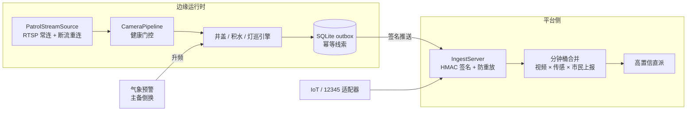

# ai-life-line
<div align="center">

**lifeline-guard — 城市生命线智能监测平台**

<!-- TODO: 首屏大图（images/hero_banner.jpg）就绪后取消注释

-->

**给城市生命线装上 AI 眼睛——用存量摄像头看住井盖、积水与路灯。**


<!-- 发布时把 OWNER/REPO 换成实际仓库路径, 并把 docs/promotion/ci.yml 复制到 .github/workflows/ci.yml -->


**[English](README_en.md)** | 简体中文

<!-- TODO: 演示动图（images/demo_flooding.gif）就绪后取消注释


*积水通道四拍：登记干态基线 → 暴雨袭来 → 物理水面分割（真实输出） → risk3 线索上送。掩膜与线索为真实分割器输出；干/湿两帧为示意配对。*
-->

</div>

---

> 🚧 **文档先行**：代码、评估脚本与验收集清单将随首个发布版本入库；文中文件名与 § 章节号以规划结构为准。

## 为什么做

城市拥有成千上万的路口摄像头，但一个井盖丢了、一段路淹了、一排灯灭了，
往往还要等市民打电话投诉。**lifeline-guard** 把存量摄像头变成三类民生
事件的一级传感器——井盖缺失位移、路面积水内涝、路灯故障——并把摄像头
看到的与 IoT 传感、市民上报在分钟桶融合总线上配对，双源命中即高置信。

## 三模型流水线

| 场景 | 标注输出 |
|------|---------|
| 积水 |  |
| 井盖 |  |
| 路灯 |  |

| 模型 | 职责 | 回答的问题 |
|------|------|-----------|
| **AI-Detect**（开放词汇检测） | L1 在位检出 | "登记的井盖现在还能被看见吗？" |
| **AI-Recognize**（免提示提议 + 区域嵌入） | L2 语义 | "这块 ROI 相对登记基线**语义**上变了吗？" |
| **AI-Reference**（Qwen3VL grounding） | 裁决 | "那片真的是积水——还是湿路面反光？" |

真实验收集上最有意思的发现：**外观距离与语义距离是互补的，不是冗余的**。
破损井盖外观剧变但语义近似（破损了也还是井盖）；掩埋/替换则双高。
`decide_change_v2` 把这个规律写成显式真值表，而"外观高、语义低"的含糊
分支正好交给 VLM 裁决定型——三件套由此形成流水线而非三个孤岛。

## 诚实的边界（先读这段）

- **湿沥青的天空反射光膜 vs 浅积水，单帧下光学/语义同构**——物理规则、
  开放词汇、2B VLM 我们全试过，全被骗（AI-Reference 单独判读湿沥青
  负样本 P=0.647）。区分信息不在这一帧里，而在时间维度：登记干态基线
  （时间证据），合成配对实验 n=120 → R、P 均 > 0.85。
- 夜间帧对积水通道属协议外（§4.3 夜间停巡降档），与人工巡逻同理。
- 本验收集（每场景 n=6~26）是**能力证据**，不是生产验收；§8.2 规模的
  受控摆拍采集是下一步。

我们认为把失败分析跟全绿数字一起发布，才是开源该有的样子。

## 快速开始

```python
import cv2
from lifeline_guard.waterlogging import (
    PhysicalWaterSegmenter, WaterloggingMonitor, WaterPointConfig)

img = cv2.imread("road.jpg")
mon = WaterloggingMonitor(
    [WaterPointConfig("W1", roi=(100, 150, 540, 430))],
    segmenter=PhysicalWaterSegmenter())
mon.set_dry_baseline("W1", cv2.imread("road_dry.jpg"))   # 登记干态基线
for frame in [img, img]:                                  # 连续 2 周期确认
    clues = mon.process(frame)
print([(c.subtype, c.risk_level, c.source_ref) for c in clues])
```

完整链路（ingest → 分钟桶合并 → outbox → VLM 复核）见
`lifeline_guard/runner.py`（JSON 配置驱动），评估工具在
`lifeline_guard/acceptance.py`：

```bash
python -m lifeline_guard.acceptance \
    --manifest lifeline_guard/tests/real_images/acceptance_manifest_v2.json
```

## 架构



## 真实验收集评估结果

| 场景 | n | R | P | §8.4 门槛 |
|------|---|---|---|-----------|
| 井盖变化检测（配对） | 6 | >0.85 | >0.85 | PASS |
| 井盖 L1 图像级检出 | 17 | >0.85 | >0.85 | PASS |
| 积水（冷启动协议） | 16 | >0.85 | >0.80 | PASS |

逐图得分、失败分析与根因定位：
`PITCH.md` · `lifeline_guard/CHANGELOG.md`（随首个发布版本提供）

## 仓库结构

```
lifeline_guard/
├── manhole.py          # 登记式基线变化检测 (L1×L2 真值表)
├── waterlogging.py     # 物理水面分割 + 干态基线门控 + 水位尺
├── streetlight.py      # 亮度巡检 + 回路级成片熄灭 + SCADA 交叉
├── embedders.py        # Normed / Recognize 嵌入 + 点位自适应阈值
├── model_gateway.py    # 统一模型加载、缓存与遥测
├── review_ref.py       # AI-Reference VLM 复核裁决 (FR-DS)
├── platform.py         # 签名 ingest 服务 + 分钟桶合并
├── adapters.py         # IoT (I 类) / 市民上报 (S 类) 适配器
├── runner.py           # 边缘运行时: 配置 → 轮巡 → outbox → 推送
├── store.py            # SQLite: 台账/审计/outbox/状态
├── acceptance.py       # 摆拍集评估, §8.4 报告 CLI
└── deploy/             # Dockerfile / compose / 示例配置
```

## License 与数据声明

代码以 **Apache License 2.0** 发布（见 [`LICENSE`](LICENSE)）。真实验收集
**不随仓库分发**；`acceptance_manifest_v2.json` 记录全部 case，复现需按
清单本地采集图片。

> 注：文中 §x.x 章节号引自项目内部规范文档，将随首个发布版本一并公开。
