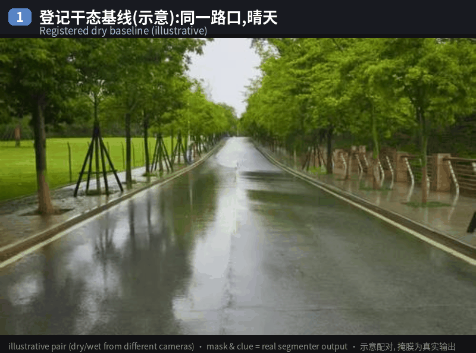
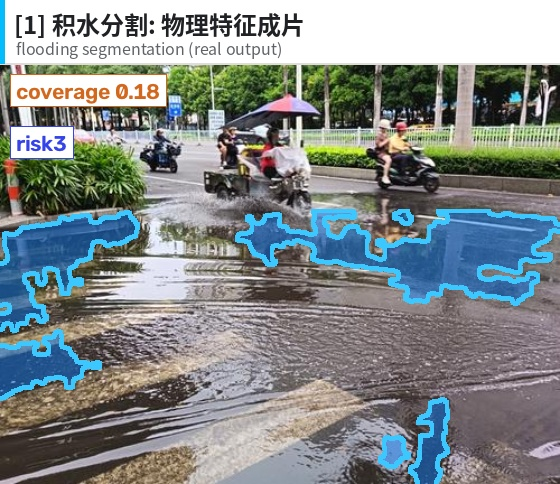
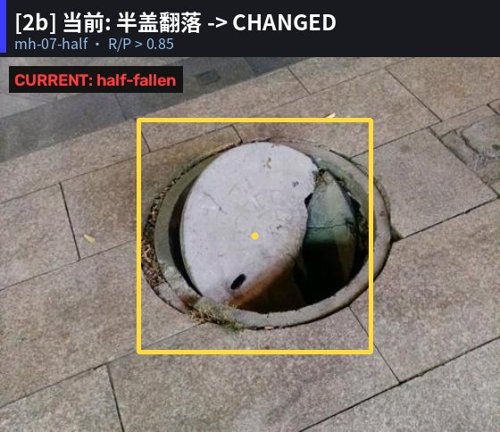
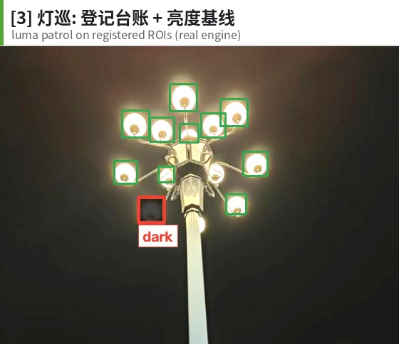
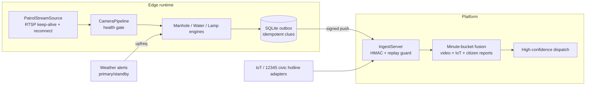

# ai-life-line
<div align="center">


**Give city lifelines an AI eye — manholes, flooding and streetlights,
watched by open-vocabulary models on existing CCTV.**


<!-- On release, replace OWNER/REPO with the real repo path and copy docs/promotion/ci.yml to .github/workflows/ci.yml -->


English | **[简体中文](README.md)**

<!-- TODO: uncomment when images/demo_flooding.gif is ready


*The flooding channel in four beats: registered dry baseline → rainstorm →
physical water segmentation (real output) → risk3 clue to the platform.
Mask and clue are real segmenter output; the dry/wet pair is illustrative.*
-->

</div>

---

> 🚧 **Docs-first**: code, the evaluation harness and the fixture manifest will land with the first release; file names and § references below follow the planned layout.

## Why

Cities already own thousands of cameras. Yet a missing manhole cover is still
usually reported by a citizen phone call. **AI Vision** turns existing
CCTV into a first-class sensor for three civic events — displaced manhole
covers, road flooding, and failed streetlights — and pairs what the camera
sees with IoT sensors and citizen reports on a minute-bucket fusion bus,
where dual-source agreement yields high confidence.

## The three-model pipeline

| Scene | Annotated output |
|-------|------------------|
| Flooding |  |
| Manhole |  |
| Streetlight |  |

| Model | Role | What it answers |
|-------|------|-----------------|
| **AI-Detect** (open-vocabulary detection) | L1 presence | "Is the manhole still visible?" |
| **AI-Recognize** (prompt-free proposals + region embeddings) | L2 semantics | "Did this ROI *semantically* change vs. its registered baseline?" |
| **AI-Reference** (Qwen3VL grounding) | adjudication | "Is that patch really flood water — or a wet-road reflection?" |

The interesting finding from our real-image fixture: **appearance-level and
semantic-level change detectors are complementary**. A broken cover scores
high on appearance distance but low on semantic distance (a broken cover is
still a cover); a buried cover scores high on both. `decide_change_v2` turns
this into an explicit truth table, and the ambiguous appearance-high /
semantic-low branch is exactly where the VLM adjudicates — the three models
form a pipeline rather than three isolated islands.

## Honest limits (read this first)

- Wet-asphalt sky reflections vs. shallow flooding are **optically ambiguous
  in a single frame** — for every model we tried, including 2B/4B/9B VLMs
  (AI-Reference alone: P=0.647 on wet-asphalt negatives). Production resolves
  this with a registered dry baseline (temporal evidence): synthetic paired
  eval n=120 → R and P both > 0.85.
- Night frames are out-of-protocol for the flooding channel by design (§4.3
  night stand-down), same as human patrols.
- Fixture numbers (n=6–26 per scenario) are *capability evidence*, not
  production acceptance. §8.2-scale staged collection is the next step.

We think publishing the failure analysis alongside the green numbers is the
more useful kind of open source.

## Quickstart

```python
import cv2
from lifeline_guard.waterlogging import (
    PhysicalWaterSegmenter, WaterloggingMonitor, WaterPointConfig)

img = cv2.imread("road.jpg")
mon = WaterloggingMonitor(
    [WaterPointConfig("W1", roi=(100, 150, 540, 430))],
    segmenter=PhysicalWaterSegmenter())
mon.set_dry_baseline("W1", cv2.imread("road_dry.jpg"))   # register dry baseline
for frame in [img, img]:                                  # 2-cycle confirm
    clues = mon.process(frame)
print([(c.subtype, c.risk_level, c.source_ref) for c in clues])
```

Full pipeline (ingest → fusion → outbox → VLM review) lives in
`lifeline_guard/runner.py` with a JSON config, and the evaluation harness in
`lifeline_guard/acceptance.py`:

```bash
python -m lifeline_guard.acceptance \
    --manifest lifeline_guard/tests/real_images/acceptance_manifest_v2.json
```

## Architecture



## Results on the real-world fixture

| Scenario | n | R | P | §8.4 gate |
|----------|---|---|---|-----------|
| Manhole change detection (pairs) | 6 | >0.85 | >0.85 | PASS |
| Manhole L1 image-level detection | 17 | >0.85 | >0.85 | PASS |
| Flooding (cold-start protocol) | 16 | >0.85 | >0.80 | PASS |

Details, per-image scores, the failure analysis and root-cause notes:
`PITCH.md` · `lifeline_guard/CHANGELOG.md` (provided with the first release)

<!-- TODO: uncomment this section when the code lands
## Repo layout

```
lifeline_guard/
├── manhole.py          # registered-baseline change detection (L1×L2 truth table)
├── waterlogging.py     # physical water segmentation + baseline gating + gauge
├── streetlight.py      # luma patrol + circuit-level group-outage + SCADA cross
├── embedders.py        # Normed / Recognize embeddings + per-point adaptive thresholds
├── model_gateway.py    # unified model loading, caching, telemetry
├── review_ref.py       # AI-Reference VLM adjudication (FR-DS)
├── platform.py         # signed ingest server + minute-bucket fusion
├── adapters.py         # IoT (I-class) / citizen-report (S-class) adapters
├── runner.py           # edge runtime: config → patrol → outbox → push
├── store.py            # SQLite: ledger/audit/outbox/state
├── acceptance.py       # staged-set evaluation, §8.4 report CLI
└── deploy/             # Dockerfile / compose / example config
```
-->

## License & data notice

This project is commercial software. The real-image fixture is **not
redistributed**;
`acceptance_manifest_v2.json` documents every case and images must be
sourced locally for reproduction.

> Note: §x.x references point to the project's internal specification, to be
> published with the first release.
