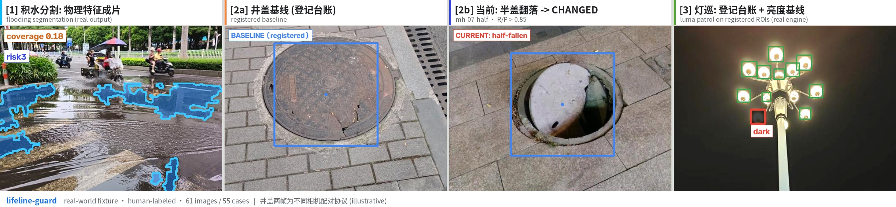
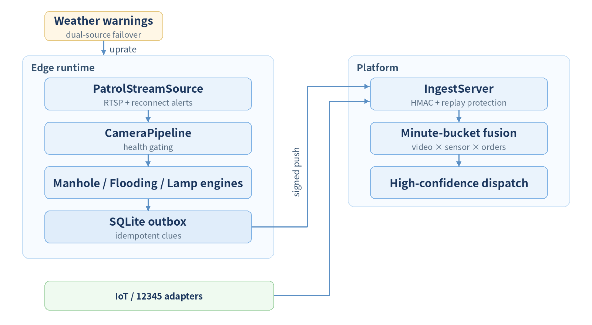
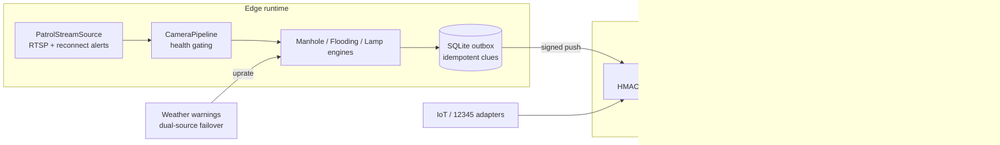

<div align="center">


**Video analysis for city lifelines: manhole covers, road flooding, and
streetlight failures detected automatically on existing CCTV.**


English | **[简体中文](README_github_zh.md)**


*Figure: flooding lane in four beats (mask and clue are real segmenter
output; dry/wet frames are an illustrative pair, declared in the footer) —
register the dry baseline → storm arrives → physical water segmentation →
risk3 clue submitted.*

</div>

---

## 1. Background

Cities operate thousands of CCTV streams, yet a missing manhole cover, a
flooded underpass, or a failed streetlight is still typically discovered
via manual patrols or citizen complaints. Four structural gaps:

| Gap | Description |
|-----|-------------|
| Coverage | Fixed camera angles and human patrols cannot cover every asset at every hour |
| Latency | Event-to-work-order latency is measured in days, with safety and PR exposure |
| False positives | Rain, reflections and shadows break legacy analytics almost completely |
| Single-source doubt | Grading from video alone trades false dispatches against missed events |

## 2. Key capabilities

| # | Capability | Description |
|---|------------|-------------|
| 01 | Existing-camera reuse | No new sensors; patrol-style analysis over the existing GA-T1400 video intake |
| 02 | One runtime, three scenarios | Manhole change (registered baselines), road flooding (physical segmentation + dry-baseline gating), streetlight failure (ledger + luma baseline) share one patrol/push/review chain |
| 03 | Dual-source grading | Video clues are paired with IoT sensors and citizen reports in a minute-bucket fusion bus; dual-source hits dispatch at high confidence |
| 04 | Weather-linked uprating | Dual-source rain warnings uprate flooding points to 1–5 fps and fall back automatically |

## 3. Three-model pipeline

| Model | Role | Question answered |
| --- | --- | --- |
| AI-Detect (open-vocabulary detection) | L1 presence | "Is the registered manhole still visible?" |
| AI-Recognize (prompt-free proposals + region embeddings) | L2 semantics | "Has this ROI semantically changed vs the registered baseline?" |
| AI-Reference (Qwen3VL grounding) | Adjudication | "Is that really flooding — or a wet-road reflection?" |

The three form a pipeline, not three islands: appearance distance and
semantic distance are **complementary, not redundant** — a broken manhole
changes appearance drastically but stays semantically a manhole, while
burial/replacement scores high on both. `decide_change_v2` encodes this as
an explicit truth table, and the ambiguous branch ("appearance high,
semantics low") goes to AI-Reference for a verdict.

## 4. Technical highlights

- **Registered baseline comparison** — manholes are registered per-ledger
  (L1 presence × L2 semantic-change truth table); only registered assets
  are patrolled, and housings/poles are never registered.
- **Physical water segmentation + dry-baseline gating** — flooding
  segmentation uses physical contiguity, gated by the registered dry
  baseline as temporal evidence (see §10, the wet-asphalt boundary).
- **Circuit-level outage detection** — streetlights are registered
  per-globe with luma baselines; single-dim and group-outage patterns are
  separated and cross-checked against SCADA.
- **Idempotent reporting & secure ingest** — SQLite outbox with at-least-once
  push, HMAC-signed ingest with replay protection, minute-bucket fusion.
- **§8.4 acceptance CLI** — one command produces the per-scenario R/P
  report with automatic threshold verdicts.

## 5. Gallery

All outputs below are real pipeline output (masks, boxes and ledger ROIs
unmodified):

| Scenario | Output |
|------|---------|
| Road flooding (physical segmentation) |  |
| Manhole change (baseline vs half-fallen) |  |
| Streetlight failure (dark clue) |  |

Four-panel overview (61 images / 55 cases):



## 6. End-to-end walkthrough

A flooding event (timestamps illustrative; decisions and fusion are the
real logic):

| Time | Stage | Description |
|------|-------|-------------|
| T-3 d | Dry baseline | Point W1 registers its dry appearance; low-frequency patrol |
| T 0:00 | Rain warning | Meteorological warning uprates W1 to 1–5 fps |
| T 0:06 | Segmentation | Physical mask coverage crosses threshold; risk3 clue raised |
| T 0:07 | Dual-source pair | IoT level sensor hits the same minute bucket → high confidence |
| T 0:08 | Dispatch | Clue dispatched to the maintenance squad; outcome written back |

## 7. Benchmarks

Scope: 61 real-scenario images, 55 evaluation cases (Baidu-sourced,
human-labeled; n=6–26 per scenario).

| Scenario | n | R | P | §8.4 gate | Result |
|------|---|---|---|-----------|------|
| Manhole change (paired) | 6 | >0.85 | >0.85 | both | Pass |
| Manhole L1 image-level detection | 17 | >0.85 | >0.85 | both | Pass |
| Flooding (cold-start protocol) | 16 | >0.85 | >0.80 | both | Pass |

| Metric | Value | Scope |
|------|------|------|
| Engineering | 262 unit tests | full suite runs without GPU (real-image regression auto-skips) |
| Failure story | wet-asphalt reflection film vs shallow flooding: three method families all fooled (Ref P=0.647) | see §10 and [`PITCH.md`](PITCH.md) |

## 8. Get started

```python
import cv2
from lifeline_guard.waterlogging import (
    PhysicalWaterSegmenter, WaterloggingMonitor, WaterPointConfig)

img = cv2.imread("road.jpg")
mon = WaterloggingMonitor(
    [WaterPointConfig("W1", roi=(100, 150, 540, 430))],
    segmenter=PhysicalWaterSegmenter())
mon.set_dry_baseline("W1", cv2.imread("road_dry.jpg"))   # register dry baseline
for frame in [img, img]:                                  # 2-cycle confirm
    clues = mon.process(frame)
print([(c.subtype, c.risk_level, c.source_ref) for c in clues])
```

Full pipeline (ingest → minute-bucket fusion → outbox → VLM review) lives
in [`runner.py`](lifeline_guard/runner.py) (JSON-config driven); the
evaluation tool is [`acceptance.py`](lifeline_guard/acceptance.py):

```bash
python -m lifeline_guard.acceptance \
    --manifest lifeline_guard/tests/real_images/acceptance_manifest_v2.json
```

## 9. Architecture



<!-- TODO: edit the mermaid source below and re-render to update the diagram

-->

## 10. Scope and limitations

- **Wet-asphalt reflection film vs shallow flooding is optically and
  semantically identical in a single frame** — physical rules, open
  vocabulary and 2B/4B/9B VLMs were all fooled (Ref P=0.647 on wet-asphalt
  negatives). The distinguishing information is not in that frame but in
  time: the registered dry baseline (temporal evidence); a paired synthetic
  experiment (n=120) reaches R, P > 0.85.
- **Night frames are out of protocol for the flooding lane** (§4.3 night
  patrol downgrade) — same as human patrols.
- **This fixture (n=6–26 per scenario) is capability evidence, not
  production acceptance**; the §8.2-scale controlled capture is next.

We believe publishing failure analysis alongside green numbers is what
open source should look like.

## 11. License & data statement

The code is commercial software. The real-world fixture is
**not distributed with the repository**;
`acceptance_manifest_v2.json` records every case — reproduce locally by
capturing images per the manifest.
